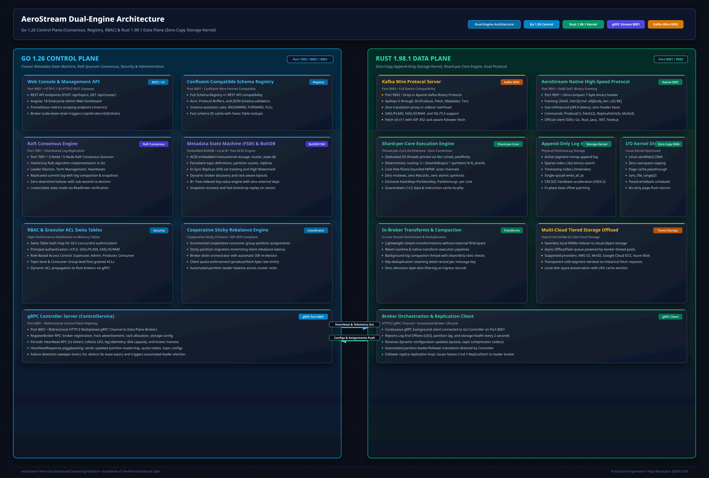

# In-Broker Stream Transforms & WASM

<div class="doc-badge-row" markdown>
<span class="md-tag md-tag--primary">WASM Engine</span>
<span class="md-tag">5 min read</span>
<span class="md-tag">Stream Processing</span>
</div>

AeroStream features an **In-Broker Stream Processing & Transformation Engine**. Instead of spinning up heavy external processing clusters (such as Apache Flink or Kafka Streams) for straightforward event sanitization, routing, or PII masking, AeroStream executes transforms inline directly on the broker.



---

## Supported Transform Types

AeroStream provides five primary classes of in-broker transforms:

1. **Inline Predicate Filtering**: Evaluates conditions against JSON fields or record headers. Records failing the predicate are cleanly discarded or routed to a Dead-Letter Queue (DLQ).
2. **Field Extraction & Projection**: Drops unwanted fields from wide JSON documents, minimizing downstream network utilization.
3. **Automated PII Data Masking (`MASK_PII`)**: Identifies sensitive personally identifiable information (credit card numbers, CVVs, passwords, SSNs) and masks them with `***`.
4. **Header Injection & Enrichment**: Inserts cluster timestamps, geographical routing tags, or tracing IDs without altering the body payload.
5. **WASM Sandboxed Logic**: Custom business rules authored in Rust, Go, or C, compiled to WebAssembly bytecode and executed in a sandboxed runtime.

---

## Automated PII Data Masking

Data privacy regulations (GDPR, PCI-DSS, HIPAA) mandate that raw sensitive credentials must never reach general analytics consumers.

With AeroStream's native PII transformation, fields containing sensitive data are masked in-flight at sub-millisecond speeds:

=== "Raw Ingress Message (`orders-raw`)"

    ```json
    {
      "order_id": "ORD-9821",
      "customer_email": "user@example.com",
      "credit_card": "4111-2222-3333-4444",
      "cvv": "782",
      "total_amount": 99.50
    }
    ```

=== "Sanitized Output Message (`orders-sanitized`)"

    ```json
    {
      "order_id": "ORD-9821",
      "customer_email": "user@example.com",
      "credit_card": "4111-****-****-4444",
      "cvv": "***",
      "total_amount": 99.50
    }
    ```

---

## WASM Sandbox Execution

For complex user-defined transformations, AeroStream provides a **WebAssembly (WASM) execution environment**:

* **Memory Isolation**: Each WASM guest operates inside a strictly isolated 64 KiB memory page sandbox. Host memory, local disk, and arbitrary sockets are completely inaccessible.
* **Deterministic CPU Budgets**: Execution runs with cycle limits (gas metering) to guarantee an infinite loop in a user transform can never lock up the broker worker threads.
* **Polyglot Authoring**: Write transformations in Rust, Go (TinyGo), C, or AssemblyScript and upload the compiled `.wasm` binary via the REST API.

```rust
// Example Rust guest function for WASM transform
#[no_mangle]
pub extern "C" fn transform(ptr: *const u8, len: usize) -> u64 {
    let payload = unsafe { std::slice::from_raw_parts(ptr, len) };
    // Custom logic: inspect, enrich, or modify
    // Return pointer and length to host
    0
}
```

---

## Transforms REST API

Transforms are configured dynamically at runtime through the Control Plane REST API (`http://localhost:9001`):

### Create a PII Masking Transform

```bash
curl -X POST http://localhost:9001/api/transforms \
  -H "Content-Type: application/json" \
  -d '{
    "id": "sanitize-orders",
    "source_topic": "orders-raw",
    "target_topic": "orders-clean",
    "type": "PII_MASK",
    "config": {
      "masked_fields": ["credit_card", "cvv", "password", "ssn"],
      "mask_pattern": "***"
    }
  }'
```

### List Active Transforms

```bash
curl -s http://localhost:9001/api/transforms | jq
```

### Terminate a Transform Pipeline

```bash
curl -X DELETE http://localhost:9001/api/transforms/sanitize-orders
```
